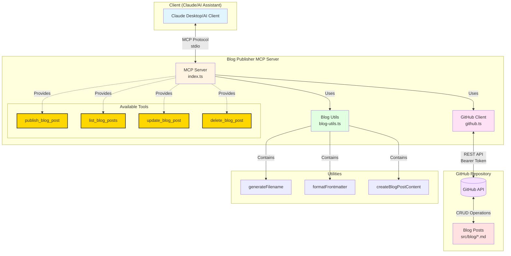

# Blog Publisher MCP Server Setup

## Prerequisites
- Node.js 18+
- GitHub Personal Access Token with repo access
- Your blog repository on GitHub

## Setup Instructions

### 1. Create the project structure
```bash
mkdir blog-publisher-mcp
cd blog-publisher-mcp
```

### 2. Initialize the project
```bash
npm init -y
# Replace package.json with the provided one
npm install
```

### 3. Create TypeScript configuration (tsconfig.json)
```json
{
  "compilerOptions": {
    "target": "ES2022",
    "module": "ESNext",
    "moduleResolution": "node",
    "esModuleInterop": true,
    "allowSyntheticDefaultImports": true,
    "strict": true,
    "outDir": "./dist",
    "rootDir": "./src",
    "skipLibCheck": true,
    "forceConsistentCasingInFileNames": true
  },
  "include": ["src/**/*"],
  "exclude": ["node_modules", "dist"]
}
```

### 4. Create src/index.ts
Put the main TypeScript code in `src/index.ts` (the main server code from the first artifact).

### 5. Set up environment variables
Create a `.env` file:
```env
GITHUB_TOKEN=your_github_personal_access_token
REPO_OWNER=your_github_username
REPO_NAME=your_blog_repo_name
```

**Important**: Add `.env` to your `.gitignore` file!

### 6. Build the project
```bash
npm run build
```

### 7. Configure Claude Desktop
Add to your Claude Desktop configuration file:

  **macOS**: `~/Library/Application Support/Claude/claude_desktop_config.json`
**Windows**: `%APPDATA%/Claude/claude_desktop_config.json`

```json
{
  "mcpServers": {
    "blog-publisher": {
      "command": "node",
      "args": ["/path/to/your/blog-publisher-mcp/dist/index.js"],
      "env": {
        "GITHUB_TOKEN": "your_github_personal_access_token",
        "REPO_OWNER": "your_github_username", 
        "REPO_NAME": "your_blog_repo_name"
      }
    }
  }
}
```

## GitHub Token Setup

1. Go to GitHub.com → Settings → Developer settings → Personal access tokens → Tokens (classic)
2. Generate new token with these scopes:
   - `repo` (Full control of private repositories)
   - `public_repo` (Access public repositories)
3. Copy the token and use it in your configuration

## Repository Structure Expected

Your blog repository should have a `blogs/` folder in the root where blog posts will be published. The server will create Markdown files with frontmatter in this structure:

```
your-repo/
├── blogs/
│   ├── my-first-post.md
│   ├── another-post.md
│   └── ...
└── (your build system files)
```

## Usage with Claude

Once configured and Claude Desktop is restarted, you can ask Claude to:

- **Publish a new blog post**: "Please publish this blog post with title 'My New Post' and the following content..."
- **List existing posts**: "Show me all my current blog posts"
- **Update an existing post**: "Update the blog post 'my-first-post.md' with new content..."

## Blog Post Format

The server automatically adds frontmatter to your blog posts:

```markdown
---
title: "Your Blog Post Title"
date: "2024-01-15T10:30:00.000Z"
description: "Optional description"
tags:
  - "tag1"
  - "tag2"
---

Your blog content in Markdown format...
```

## Development

For development, you can run the server directly:
```bash
npm run dev
```

## Features in V0

✅ Publish new blog posts to `/blogs` folder
✅ List existing blog posts  
✅ Update existing blog posts
✅ Automatic frontmatter generation
✅ Duplicate filename protection
✅ Commit messages with post titles

## Next Steps (Future Versions)

- File upload support for images
- Draft management
- Blog post templates
- Category/folder organization
- Bulk operations
- Preview generation


## Architecture Diagram

